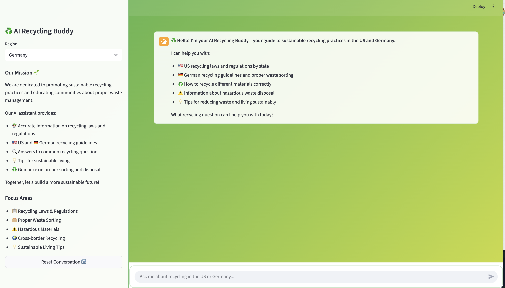
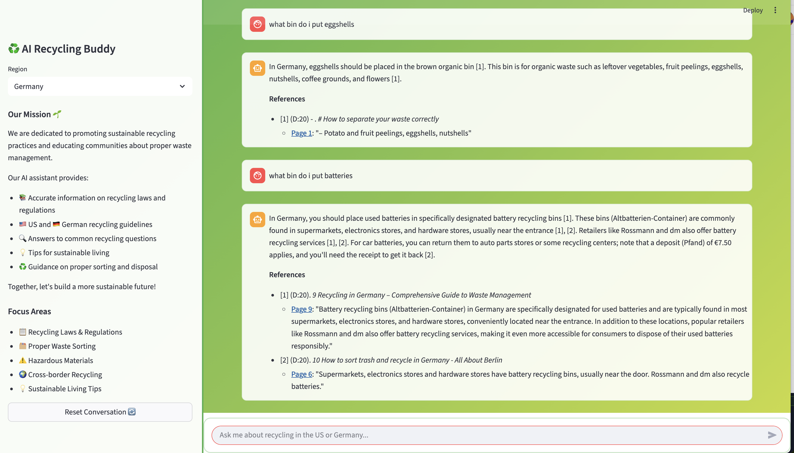
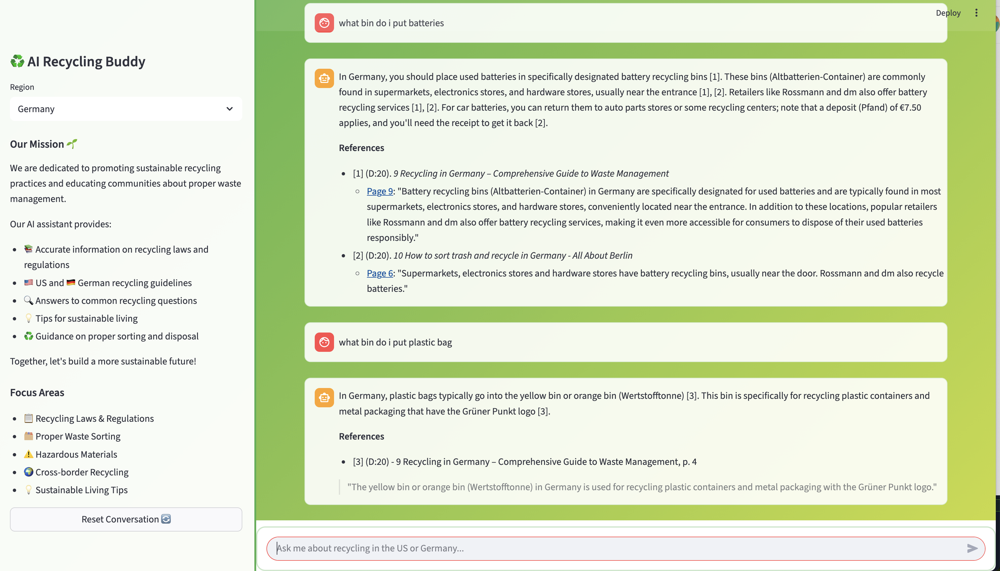
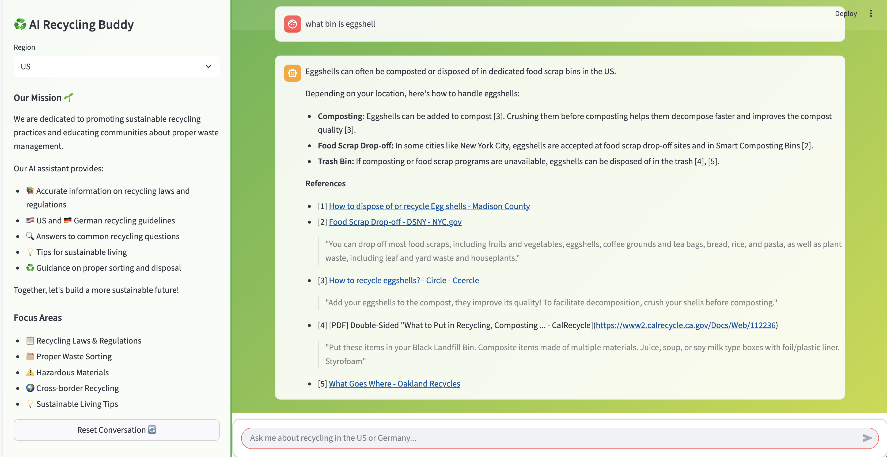
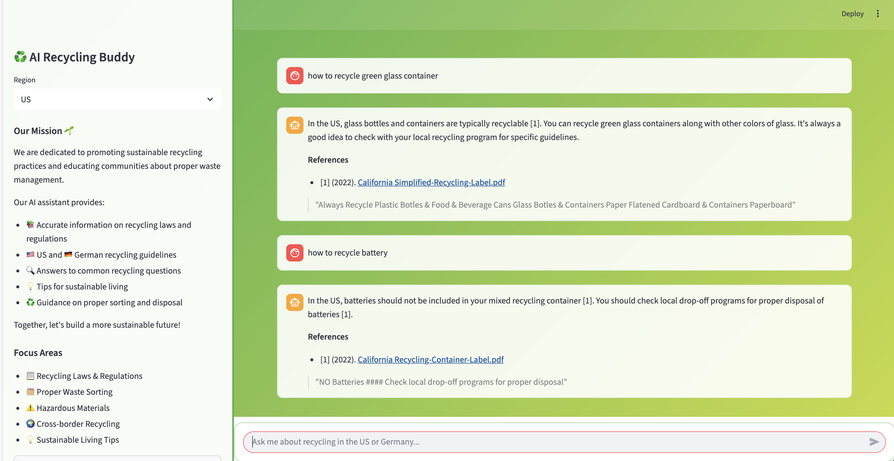
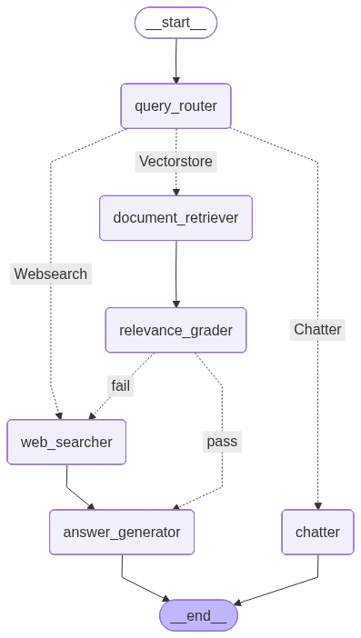

# ♻️ AI Recycling Agent

An intelligent AI-powered chatbot designed to help users navigate recycling laws and practices in the United States and Germany. Built with advanced RAG (Retrieval-Augmented Generation) technology, this chatbot provides accurate, region-specific recycling guidance.

## 👥 Authors

**Katja Crusius** and **Joan Zheng**

## 🌟 Features

- **Region-Specific Guidance**: Choose between US and German recycling regulations
- **Intelligent Document Retrieval**: Uses vector search to find relevant recycling information
- **Multi-Query RAG**: Employs advanced retrieval techniques for comprehensive answers
- **Interactive Web Interface**: Clean, user-friendly Streamlit interface
- **Real-time Citations**: Provides clickable links to source documents
- **Context-Aware Responses**: Maintains conversation history for better interactions

## 📸 Screenshots

### Welcome Interface


### German Recycling Examples



### US Recycling Examples




## 🚀 Quick Start

### Prerequisites

- Python 3.12+
- Poetry (for dependency management)
- Google Gemini API key
- Tavily API key (for web search)

### Installation

1. **Clone the repository**
   ```bash
   git clone <repository-url>
   cd SusTech Recycling Agent
   ```

2. **Install dependencies**
   ```bash
   poetry install
   ```

3. **Set up environment variables**

   Copy the example environment file:
   ```bash
   cp .env.example .env
   ```

   Edit `.env` with your API keys:
   ```bash
   # Required API Keys
   GEMINI_API_KEY=your_gemini_api_key_here
   TAVILY_API_KEY=your_tavily_api_key_here

   # Google Cloud Configuration
   GOOGLE_APPLICATION_CREDENTIALS=/path/to/your/vertex-ai-key.json
   DEFAULT_GOOGLE_PROJECT=your_project_id
   GOOGLE_CLOUD_LOCATION=us-west2
   GOOGLE_GENAI_USE_VERTEXAI=True

   # Optional: OpenAI (fallback)
   # OPENAI_API_KEY=your_openai_key_here
   ```

4. **Build the knowledge base**
   ```bash
   make embed
   ```

5. **Start the API server**
   ```bash
   make api
   ```

6. **Launch the web interface** (in a new terminal)
   ```bash
   make ui
   ```

## 💻 Usage

1. Open your browser to `http://localhost:8501`
2. Select your region (US or Germany) from the dropdown
3. Ask recycling-related questions in natural language
4. Get AI-powered answers with citations to official sources

### Example Questions

- "What bin does eggshells go in?"
- "How do I recycle electronics in Germany?"
- "Can I recycle pizza boxes?"
- "What materials are considered hazardous waste?"

## 🏗️ Architecture

### Technology Stack

- **Frontend**: Streamlit
- **Backend**: FastAPI
- **AI/ML**:
  - LangChain for RAG pipeline
  - Google Gemini for text generation
  - Google Generative AI Embeddings
  - FAISS for vector storage
- **Data Processing**:
  - PyMuPDF for PDF processing
  - LangChain text splitters
- **APIs**:
  - Tavily for web search
  - Google Vertex AI

### Dialogue Flow with LangGraph



*Figure: LangGraph workflow showing the RAG pipeline with query routing, document retrieval, web search, and answer generation nodes.*

### System Components

1. **Document Processing Pipeline**
   - Loads and processes recycling law documents
   - Creates vector embeddings for semantic search
   - Stores indexed documents in FAISS vectorstore

2. **Query Processing**
   - Multi-query generation for comprehensive retrieval
   - MMR (Maximal Marginal Relevance) ranking
   - RRF (Reciprocal Rank Fusion) for result combination

3. **Answer Generation**
   - Context-aware response generation
   - Automatic citation formatting
   - Region-specific guidance

4. **Web Interface**
   - Region selection
   - Chat interface with history
   - Citation display with clickable links

## 📁 Project Structure

```
SusTech Recycling Agent/
├── src/
│   ├── agent/                 # AI agent components
│   │   ├── answer_generator.py    # Answer generation logic
│   │   ├── document_retriver.py   # Document retrieval
│   │   ├── state.py               # Application state management
│   │   └── ...
│   ├── utils/                 # Utility functions
│   │   ├── llm.py                 # LLM integration
│   │   ├── logging.py             # Logging utilities
│   │   └── ...
│   ├── recycling_docs/        # Source documents
│   ├── vector_store/          # FAISS vectorstore
│   ├── serve.py               # FastAPI server
│   └── streamlit_ui.py        # Web interface
├── img/                       # Screenshots and assets
├── .env                       # Environment configuration
├── pyproject.toml             # Python dependencies
├── Makefile                   # Build automation
└── README.md                  # This file
```

## 🔧 Development

### Available Make Commands

- `make api` - Start the FastAPI server
- `make ui` - Start the Streamlit interface
- `make embed` - Rebuild the vectorstore
- `make clean` - Clean build artifacts

### Adding New Documents

1. Place PDF files in `src/recycling_docs/`
2. Run `make embed` to process and index them
3. The system will automatically detect the region (US/Germany) based on filename

### Testing

```bash
# Run with test mode (processes only first file)
TEST_RUN=true poetry run python src/Knowledge.py

# Test specific file
TEST_RUN=true TEST_FILE_NAME="your-file.pdf" poetry run python src/Knowledge.py
```

## 🧪 Evaluation Suite

The project includes a comprehensive evaluation framework for testing the AI recycling assistant's accuracy and performance across multiple recycling categories and languages.

📋 **Detailed Evaluation Methodology**: See [`EVALUATION_SYSTEM.md`](EVALUATION_SYSTEM.md) for complete evaluation framework documentation.

### Evaluation Results

**Overall Performance:**
- **Accuracy**: 85.61% (154/180 correct categorizations)

**Category-wise Performance:**
| Category | Accuracy | Correct/Total |
|----------|----------|---------------|
| Glass (Glas) | 94.4% | 34/36 |
| Hazardous (Sondermüll) | 91.7% | 33/36 |
| Plastic (Kunststoff) | 78.6% | 33/42 |
| Paper (Papier) | 83.3% | 30/36 |
| Metal (Metall) | 66.7% | 20/30 |

**Regional Performance:**
- **United States**: 87.8% (79/90 correct)
- **Germany**: 83.3% (75/90 correct)

**Linguistic Performance:**
- **English**: 87.8% (79/90 correct)
- **German**: 83.3% (75/90 correct)

### Evaluation Components

1. **Linguistic Test Cases**: Questions like "how do I recycle X", "how do I sort Y", "what bin does Z go in" for frequently recycled items
2. **Response Simplification Agent**: Reduces complex responses to single phrases for accurate evaluation
3. **Multi-Category Statistics**: Accuracy measurements across US and German recycling categories
4. **Cross-Language Evaluation**: Tests for both English and German language support

### Running Evaluations

```bash
# Navigate to the evaluation directory
cd src/evaluation

# 1. Generate evaluation test cases
python generate_test_suite.py

# 2. Run evaluation suite (uses FastAPI server)
python run_evaluation.py

# 3. Generate evaluation report with visualizations
python generate_report.py
```

### How Evaluation Works

The evaluation system uses the **FastAPI server** to ensure consistent testing:

1. **Server Management**: Automatically checks if the server is running on `localhost:8000`
2. **Auto-Start**: If server isn't running, starts it automatically using `serve.py`
3. **HTTP Queries**: Makes HTTP requests to `/query` endpoint with region-specific parameters
4. **German Bin Support**: Properly recognizes German recycling bin names:
   - `Gelber Sack` (Yellow Bag) - plastics and metals
   - `Altglascontainer` (Glass Container) - glass bottles/jars
   - `Altpapier` (Paper Recycling) - paper and cardboard
   - `Restmüll` (General Waste/Landfill) - non-recyclable waste
   - `Sammelstelle` (Collection Point) - hazardous/special waste

### Test Case Examples

**English (US)**:
- "How do I recycle a plastic bottle?" → "recycling bin - remove cap and label"
- "Where does aluminum foil go?" → "recycling bin"
- "Can I recycle pizza boxes?" → "landfill - contaminated"

**German (Germany)**:
- "Wie recycelt man eine Plastikflasche?" → "Gelber Sack - Deckel abnehmen"
- "Wohin kommt Alufolie?" → "Gelber Sack"
- "Kann man Pizzakartons recyceln?" → "Restmüll - verschmutzt"

### Evaluation Output

The evaluation suite generates:
- `evaluation_test_cases.json`: Generated test cases
- `evaluation_results.json`: Raw evaluation results
- `evaluation_report.txt`: Text summary report
- `evaluation_details.csv`: Detailed CSV report
- `evaluation_charts/`: Visualizations and charts

### Understanding Results

The evaluation measures:
- **Overall Accuracy**: Percentage of correct recycling advice
- **Regional Performance**: Accuracy for US vs Germany
- **Language Performance**: Accuracy for English vs German
- **Category Performance**: Accuracy by material type (plastic, glass, paper, etc.)
- **Response Time**: Average time to generate answers
- **Error Analysis**: System errors and failure modes

### Achieved Performance

✅ **Overall**: 85.61%
✅ **Regional**: US 87.8%, Germany 83.3%
✅ **Language**: English 87.8%, German 83.3%
✅ **Response time**: <3 seconds average (target met)


## 🙏 Acknowledgments

- Uses official recycling guidelines from California and German environmental agencies
- Powered by Google's Gemini AI and LangChain framework
